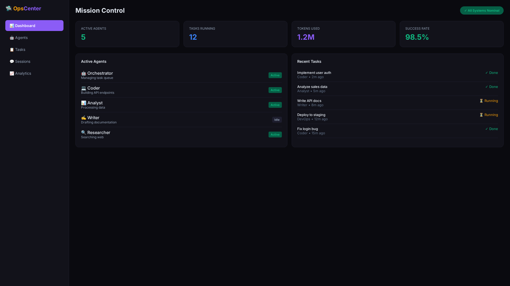

<div align="center">
  
  
  
  
</div>

<br>

<div align="center">
  <h1>🛸 Hermes Mission Control</h1>
  <p><strong>AI Agent Operations Dashboard</strong></p>
  <p>Real-time monitoring, task management, and operational visibility for Hermes AgentOS subagents</p>
  <p>
    <a href="#-features">Features</a> •
    <a href="#-quick-start">Quick Start</a> •
    <a href="#-architecture">Architecture</a>
  </p>
</div>

---

## 📸 Screenshot


*Real-time AI agent operations dashboard — captured from the running server (live system metrics + task board).*

> The dashboard reads live VPS metrics (CPU/memory/disk) and the task board from SQLite. Agent/session panels show an error state unless a Hermes Gateway state directory is mounted — that is expected when run standalone.

## ✨ Features

- **Live System Monitoring** — Real-time CPU, memory, and disk stats from the host
- **Task Board** — Persistent task list (SQLite) with create / update / delete
- **Session & Activity Views** — Reads Hermes `agent-logs.db` / `state.db` when mounted
- **WebSocket / SSE Updates** — Live event stream (`/events`) for agent state changes
- **Markdown Content** — Serve/edit markdown notes via `/api/content`
- **Zero Dependencies** — Pure Python stdlib (`http.server` + `sqlite3`); no pip install needed
- **Dark Ops UI** — Token-themed dashboard (`tokens.css`)

---

## 🚀 Quick Start

### Run directly (no install)

```bash
git clone https://github.com/OneByJorah/OpsCenter.git
cd OpsCenter
python3 server.py
```

Open **http://localhost:51763** in your browser.

> No `pip install` required — the server uses only the Python standard library.
> Set `PORT` / `BIND` env vars to change the listen address (default `127.0.0.1:51763`).

### Docker

```bash
docker compose up -d --build
# → http://localhost:51763
```

The container healthchecks `/api/health` and mounts the host Hermes home
(`~/.hermes`, read-only) for agent logs/state.

---

## 🏗️ Architecture

```
Browser (index.html / app.js) ──HTTP + SSE──▶ Python stdlib server (server.py)
                                              │
                                              ├── SQLite (board.db — task board)
                                              └── Hermes home (~/.hermes):
                                                  gateway_state.json, agent-logs.db, state.db
```

- **Backend:** Python 3.11 stdlib only (`http.server`, `socketserver`, `sqlite3`)
- **Frontend:** `index.html` + `app.js` + `components.js` + `tokens.css` (vanilla JS)
- **Storage:** local `board.db` (SQLite) for the task board; Hermes state read from `HERMES_HOME`

### Project Structure

```
OpsCenter/
├── server.py              # Python backend (HTTP + SSE + API)
├── app.js                 # Frontend application logic
├── components.js          # Reusable UI components
├── index.html             # Main dashboard page
├── tokens.css             # Token-themed styling
├── start.sh               # Quick-start script
├── Dockerfile             # python:3.11-alpine, stdlib-only
├── docker-compose.yml     # single service + volume for board.db
├── .env.example           # PORT / API key / HERMES_HOME
└── docs/screenshots/      # captured from the running server
```

---

## 🔧 API Endpoints

| Endpoint | Method | Description |
|----------|--------|-------------|
| `/` | GET | Main dashboard UI |
| `/api/health` | GET | Health check (`{"status":"ok",...}`) — used by Docker HEALTHCHECK |
| `/api/snapshot` | GET | Live system + Hermes snapshot (JSON) |
| `/events` | GET | Server-Sent Events stream of state changes |
| `/api/board` | GET / POST | List / create task-board items |
| `/api/board/update?id=` | POST | Update a task |
| `/api/board/delete?id=` | POST | Delete a task |
| `/api/content` | GET / POST | Read / save markdown content |
| `/api/content/get?path=` | GET | Fetch a content file by path |

---

## 📄 License

MIT © Jhonattan L. Jimenez

See [LICENSE](LICENSE) for full text.

---

<div align="center">
  <p>🛸 Mission control for your AI agent fleet</p>
  <p><a href="https://github.com/OneByJorah">@OneByJorah</a></p>
</div>
