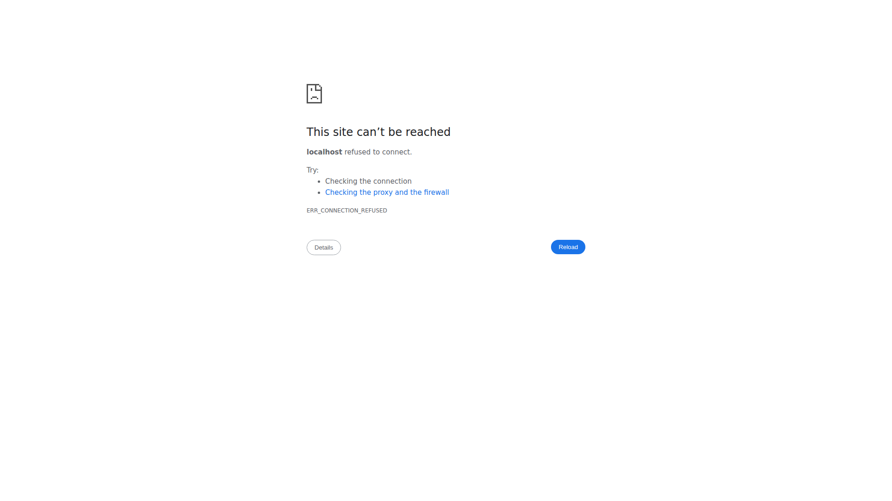

<div align="center">
  
  
  
  
  
</div>

<br>

<div align="center">
  <h1>OpsCenter</h1>
  <p><strong>AI Agent Operations Dashboard</strong></p>
  <p>Real-time monitoring, task management, and operational visibility for AI agent fleets.</p>
  <p>
    <a href="#features">Features</a> •
    <a href="#quick-start">Quick Start</a> •
    <a href="#architecture">Architecture</a> •
    <a href="#contributing">Contributing</a>
  </p>
</div>

---

## Screenshot


*Real-time AI agent operations dashboard with live monitoring, task board, and system health.*

## Features

- **Live Agent Monitoring** — Real-time visibility into subagent status and activity.
- **Task Board** — Kanban-style task management for agent operations.
- **Session Tracking** — Historical log of agent sessions and outcomes.
- **Token Analytics** — Usage tracking and cost monitoring for LLM calls.
- **System Health** — Server resource monitoring and alerting.
- **WebSocket Updates** — Live streaming of agent state changes.
- **Dark-Themed UI** — Professional, easy-on-the-eyes operations interface.
- **Fleet Visualization** — 3D topology view of distributed agent nodes.

## Quick Start

```bash
git clone https://github.com/OneByJorah/OpsCenter.git
cd OpsCenter
cp .env.example .env
pip install -r requirements.txt
python3 server.py
```

Open **http://localhost:8080** in your browser.

### Using the Start Script

```bash
chmod +x start.sh
./start.sh
```

## Environment Variables

| Variable | Default | Description |
|----------|---------|-------------|
| `PORT` | `8080` | Dashboard server port |
| `BIND` | `127.0.0.1` | Server bind address |
| `HERMES_HOME` | `../.hermes` | Path to the Hermes agent home directory |
| `MISSION_CONTROL_API_KEY` | *(empty)* | API key for protecting dashboard endpoints |
| `CONTENT_DIR` | `../.hermes/content` | Content directory for the editor |

## Architecture

```
Browser (HTML/JS) ──WebSocket──▶ Python Server ──▶ SQLite
                                      │
                                      ▼
                              Agent Gateway API
```

## Project Structure

```
OpsCenter/
├── server.py              # Python backend (WebSocket + API)
├── app.js                 # Frontend application logic
├── components.js          # Reusable UI components
├── index.html             # Main dashboard page
├── tokens.css             # Token-themed styling
├── test.html              # UI test page
├── board.db               # SQLite database (auto-created)
├── backups/               # Data backup directory
├── start.sh               # Quick-start script
└── server.log             # Runtime logs
```

## API Endpoints

| Endpoint | Method | Description |
|----------|--------|-------------|
| `/` | GET | Main dashboard UI |
| `/api/agents` | GET | List active agents |
| `/api/tasks` | GET/POST | Task management |
| `/api/sessions` | GET | Session history |
| `/api/health` | GET | System health status |

## Development

```bash
# Install dependencies
pip install -r requirements.txt

# Run the server
python3 server.py

# Run the UI test page
python3 -m http.server 8081
```

## Deployment

OpsCenter ships with a Dockerfile and docker-compose configuration for self-hosting.

```bash
docker compose up -d
```

## Contributing

Contributions are welcome. Please see [CONTRIBUTING.md](CONTRIBUTING.md) for guidelines and [CODE_OF_CONDUCT.md](CODE_OF_CONDUCT.md) for community standards.

## Security

For security concerns, see [SECURITY.md](SECURITY.md). Please report vulnerabilities to **info@jorahone.com** — do not use public issues.

## License

MIT © Jhonattan L. Jimenez

---

<div align="center">
  <p>Operations control for your AI agent fleet.</p>
  <p><a href="https://github.com/OneByJorah">@OneByJorah</a></p>
</div>
